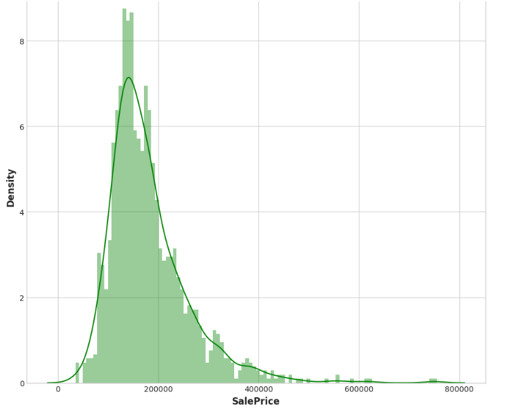
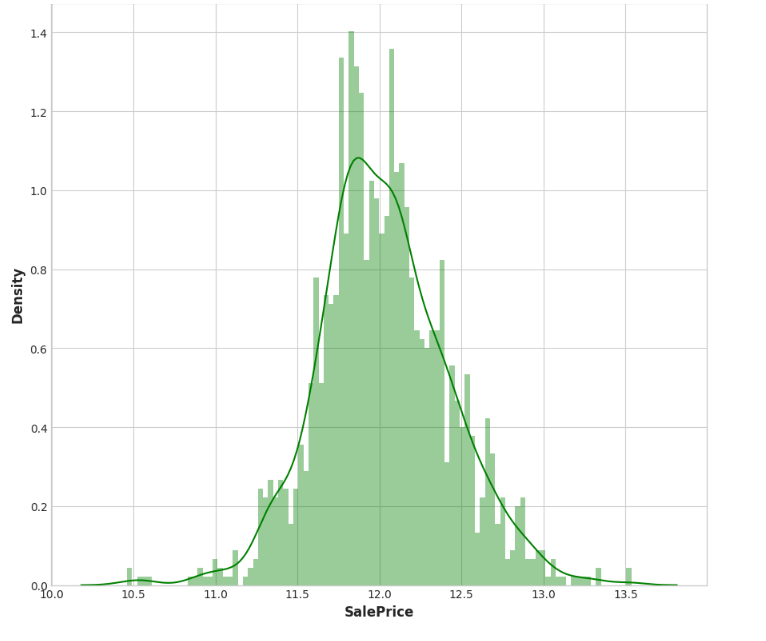
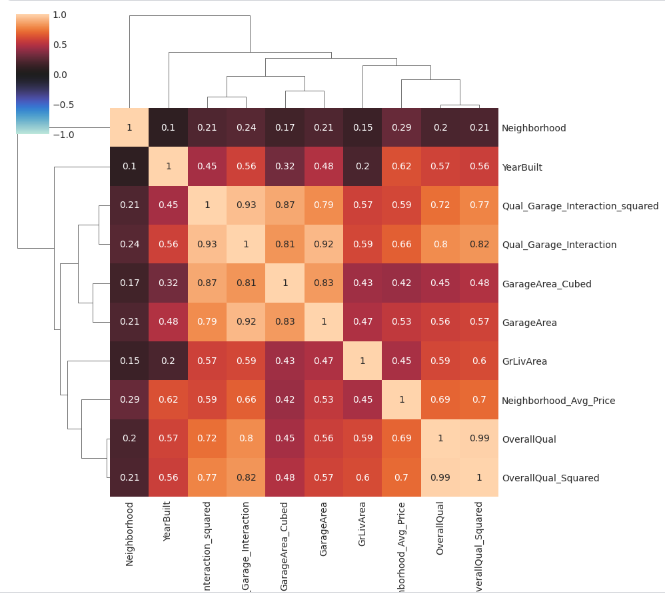

### Proyecto: Ingeniería de Características para la Predicción de Precios de Viviendas

# >> Objetivo: practicar ingeniería de características como se estudió en el curso.

#### Archivos:

En el archivo "tfml3 (main file)" se practico principalmente ingenieria de caracteristicas, y se creo modelos de DL con tensorflow utilizando capas densas, dropout y regularizadores

En el archivo "tfml2-reg-housing-prices-pred" se puso en practica la aplicacion de XGBoost como modelo principal para predecir la variable objetivo

### Descripción de la Competencia

**Objetivo de esta:** Predecir el precio final de cada vivienda en Ames, Iowa, utilizando un conjunto de datos con 79 variables que describen diversos aspectos de las propiedades residenciales.

**Habilidades a Practicar:**
- Ingeniería de características creativa
- Técnicas avanzadas de regresión, como bosques aleatorios y boosting de gradiente

**Agradecimientos:**
El conjunto de datos de viviendas de Ames fue compilado por Dean De Cock y se usa para educación en ciencia de datos, siendo una alternativa moderna y ampliada al conjunto de datos de viviendas de Boston.

**Evaluación:**
- **Métrica:** El rendimiento se mide con el Error Cuadrático Medio (RMSE) entre el logaritmo de los valores predichos y el logaritmo de los precios de venta observados. Esta métrica iguala el impacto de errores en casas caras y baratas.

# Gráficos Hechos

**Distribución de "SalePrice", con ello la vemos sesgada a la izquierda.**

**Var. objetivo normalizada a través de una transformación matemática, calc. log**

Esto le permitirá al modelo tener una mejor distribución de los datos y mejorar la precisión de las predicciones.

**Matriz de correlación:** Se utilizó la matriz de correlación para escoger, tras el Mutual Information Score, aquellas características extremadamente correlacionadas. De esta manera, se puede "alimentar" el algoritmo de creación de características PCA con las variables más relevantes.

### Proyecto: Ingeniería de Características para la Predicción de Precios de Viviendas

Este proyecto se centra mas en la práctica de la ingeniería de características que en el diseño y entrenamiento de modelos ML/DL efectivos (Use XGboost y Crossvalidation de evaluacion para evaluar un RMSE score que represente la calidad del modelo en funcion de sus predicciones). 

En este proyecto se utilizaron diversas técnicas y análisis para mejorar las predicciones de precios de viviendas. A continuación, se describe el enfoque y las técnicas utilizadas:

**Habilidades Practicadas:**

- **Ingeniería de características creativa:** Transformaciones matemáticas, creación de nuevas características y evaluación de su impacto (a traves de baselines como "score_dataset").
- **Análisis de distribuciones y transformaciones:** Utilización de distribuciones estadísticas y transformaciones matemáticas para mejorar la calidad de los datos.
- **Evaluación de características:** Empleo de algoritmos como Información Mutua (MI) y Análisis de Componentes Principales (PCA) tras la matriz de correlación para evaluar las características.
- **Modelos avanzados de regresión:** Implementación de modelos como boosting de gradiente para mejorar las predicciones (a traves de libreria XGBoost) y evaluacion cruzada para que esta ultima sea mas "objetiva".

**Agradecimientos:**

El conjunto de datos de viviendas de Ames fue compilado por Dean De Cock para su uso en educación en ciencia de datos, ofreciendo una alternativa moderna al conjunto de datos de viviendas de Boston.

**Evaluación:**

- **Objetivo:** Predecir el precio de venta de cada casa en el conjunto de prueba.
- **Métrica:** Las predicciones se evalúan en función del Error Cuadrático Medio (RMSE) entre el logaritmo del valor predicho y el logaritmo del precio de venta observado, equilibrando los errores entre casas caras y baratas.

**Detalles del Proyecto:**

En este notebook, se han aplicado varias técnicas de ingeniería de características, incluyendo:

1. **Análisis de distribuciones:** Evaluación de las distribuciones de las variables y aplicación de transformaciones para mejorar la normalidad.
2. **Creación de nuevas características:** Generación de características adicionales basadas en combinaciones y transformaciones de las existentes.
3. **Evaluación de características:** Uso de métodos como MI y PCA para identificar las características más relevantes.
4. **Modelos de regresión:** Implementación y evaluación de modelos avanzados para predecir los precios de venta.

Este proyecto demuestra la importancia de una ingeniería de características cuidadosa, la evaluación continua a través de la pipeline ("main") y la aplicación de modelos avanzados para obtener predicciones precisas en un problema de regresión compleja. 

