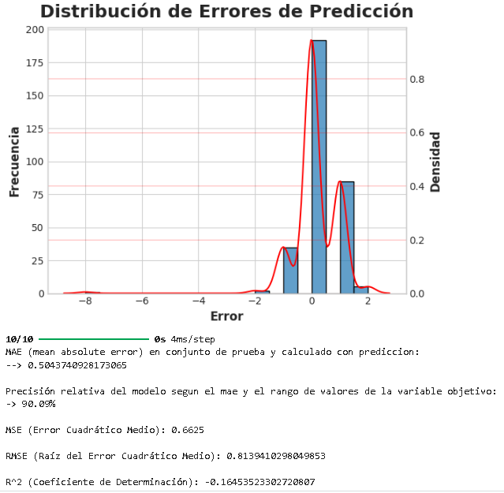
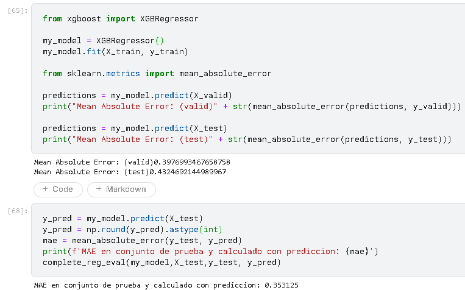
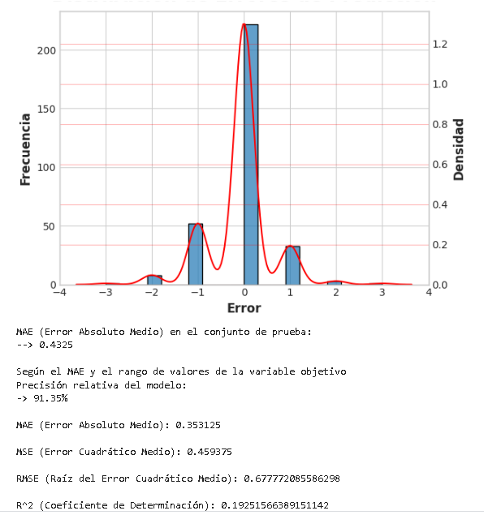

# XGBoost VS Dense Layers de tensorflow

3/8/24
Objetivo Practico: aplicacion de conceptos de ML y DL, comparativa simple y basica de modelos

Objetivo del problema: Predecir calidad de vinos (rango numerico : 3 - 8). 

Conclusion: Podemos observar lo "todo terreno" que es XGboost incluso pese a mi equivocación inicial en la naturaleza del problema, ya que pese a ello dio resultados muy buenos.

Para solucionar el mal desempeño del modelo de DL deberia de modificar la arquitectura a fin de que se adapte al problema de clasif. usando activacion softmax y metricas como "categorical_crossentropy". 

Logros:

al 2/8/24 logre crear funciones para representar rapidamente la distribucion de errores y evaluar modelos de tf y scikit

## Comparativas de metricas de evaluación:

### Dense Layers 

)

### Métricas del Modelo

1. **MAE (Mean Absolute Error)**:
   - **Valor**: 0.5069715678691864
   - **Interpretación**: El MAE es el promedio de los errores absolutos entre las predicciones y los valores reales. En promedio, el modelo se desvía por aproximadamente 0.507 unidades de los valores reales.

2. **MSE (Mean Squared Error)**:
   - **Valor**: 0.635537699597051
   - **Interpretación**: El MSE es el promedio de los errores al cuadrado. Penaliza más los errores grandes debido a la cuadratura. Un MSE de 0.636 indica la magnitud promedio del error al cuadrado.

3. **RMSE (Root Mean Squared Error)**:
   - **Valor**: 0.7972049736170147
   - **Interpretación**: El RMSE es la raíz cuadrada del MSE. Da una medida del error en las mismas unidades que los datos originales. Un RMSE de 0.797 indica que, en promedio, las predicciones del modelo se desvían en aproximadamente 0.797 unidades de los valores reales.

4. **R² (Coeficiente de Determinación)**:
   - **Valor**: -0.11713780523343575
   - **Interpretación**: El R² mide la proporción de la varianza en los datos que es explicada por el modelo. Un valor negativo indica que el modelo es peor que un modelo de regresión simple que predice la media de los valores reales. Un R² de -0.117 sugiere que el modelo no está capturando bien la variabilidad de los datos y es incluso peor que simplemente predecir el valor promedio.

### XGBoost

### Metrica fundamental: 
**R² (Coeficiente de Determinación)**:
   - **Valor**: 0.2
   - **Interpretación**: El R² mide la proporción de la varianza en los datos que es explicada por el modelo. En este caso el valor positivo indica que el modelo es mejor que un modelo de regresión simple que predice la media de los valores reales. Un R² de 0.2 sugiere que el modelo está capturando bien la variabilidad de los datos, siendo incluso mejor que simplemente predecir el valor promedio.

