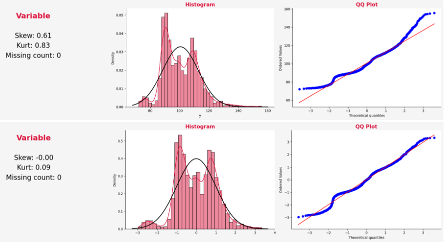

---

---

In this [data science competition](https://www.kaggle.com/competitions/mercedes-benz-greener-manufacturing/overview) organized by Mercedes-Benz, the goal was to reduce the time that vehicles spend on the test bench by predicting the time required for testing different car configurations. Participants worked with a dataset representing various combinations of features in Mercedes-Benz vehicles.

To tackle this challenge, I implemented a rigorous approach that includes:

1. **Exploratory Data Analysis (EDA)**: I conducted an exhaustive analysis to understand the distributions, identify patterns, and detect potential anomalies or outliers in the data, considering the specific nature of the car configurations.

3. **Advanced Regression Models**: I implemented and evaluated various regression techniques, such as Random Forests and Gradient Boosting, to model the complex relationships between vehicle features and test time. Ultimately, I chose XGBoost, optimizing for accuracy while minimizing computational cost.

4. **Algorithm Optimization**: Given the focus on test speed, I optimized the models not only for accuracy but also for efficiency, contributing to a reduction in test time without compromising Mercedes-Benz's safety standards.

Thanks to this comprehensive approach, I achieved outstanding performance in predicting test times.